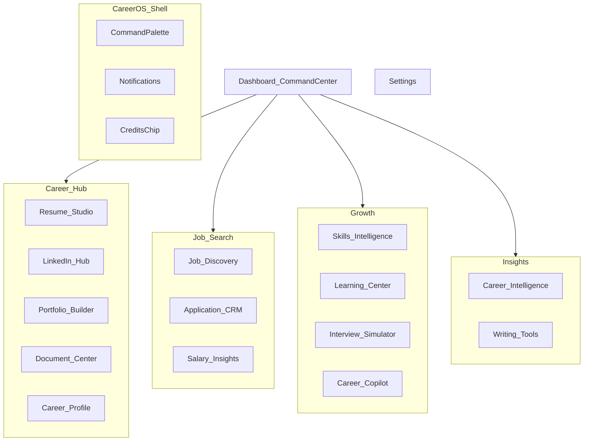

# Information Architecture — Phase 2

## Product metaphor

**GlowMinds Career Operating System** — workspaces, not an admin sidebar of forms.

## Primary navigation (proposed)

### Nav structure

| Group | Label in UI | Items | Routes (unchanged) |
|-------|-------------|-------|--------------------|
| — | Dashboard | Command Center | `/dashboard` |
| Career Hub | Career | Resume Studio, LinkedIn Hub, Portfolio, Vault, Profile | `/dashboard/resume`, `/linkedin`, `/profile/public`, `/vault`, `/profile` |
| Job Search | Jobs | Discovery, Applications, Salary | `/jobs`, `/applications`, `/salary` |
| Growth | Grow | Skills, Learning, Interview, Copilot | `/skills`, `/learning`, `/interview`, `/ai` |
| Insights | Insights | Analytics; Writing Tools (Cover, Grammar, Paraphrase) | `/analytics`, `/cover-letters`, `/grammar-check`, `/paraphrase` |
| — | Settings | Account / Privacy / Preferences | `/dashboard/settings` |

**Changes vs today**

- Rename labels only in Phase 10 (URLs stay for bookmarks).
- Move **Profile** into Career Hub (today: avatar menu only).
- Promote **Analytics** out of collapsed Tools into **Insights**.
- Writing tools become secondary under Insights (or ⌘K).
- Default: Career + Jobs + Grow open; Insights collapsed.

## Shell chrome

1. **Left:** Workspace nav (icon + label; collapse to icons).
2. **Top:** Workspace title · breadcrumb · global search · ⌘K · notifications · credits · avatar.
3. **Main:** Workspace canvas (never bare).
4. **Mobile:** Bottom bar — Home | Jobs | Growth | More (sheet with Career + Insights + Settings). Notifications in top of More sheet.

## Command palette destinations

- Navigate to any workspace route  
- “Run ATS check”, “Start mock interview”, “Open Copilot with seed…”  
- “Go to application: {company}” (when data loaded)  
- Theme toggle, Settings  

## Dashboard deep-links

| Widget | Destination |
|--------|-------------|
| Resume Health | `/dashboard/resume?tab=ats` |
| LinkedIn Health | `/dashboard/linkedin` |
| Today’s Focus item | contextual route |
| Job recommendations | `/dashboard/jobs/:id` |
| Upcoming interviews | `/dashboard/applications` |
| Learning progress | `/dashboard/learning` |
| Weekly progress | `/dashboard/analytics` |
| Copilot chips | `/dashboard/ai` with seed |
| Career Timeline | `#timeline` on Dashboard or Insights |

## Public surfaces

| Surface | Route | Auth |
|---------|-------|------|
| Portfolio | `/u/:slug` | Public |
| Portfolio Builder | `/dashboard/profile/public` | Owner |
| Extension | Chrome MV3 popup | Desktop |

## Scalability rule

New features land under an existing workspace group first. Only add a top-level group when ≥3 related destinations exist.
